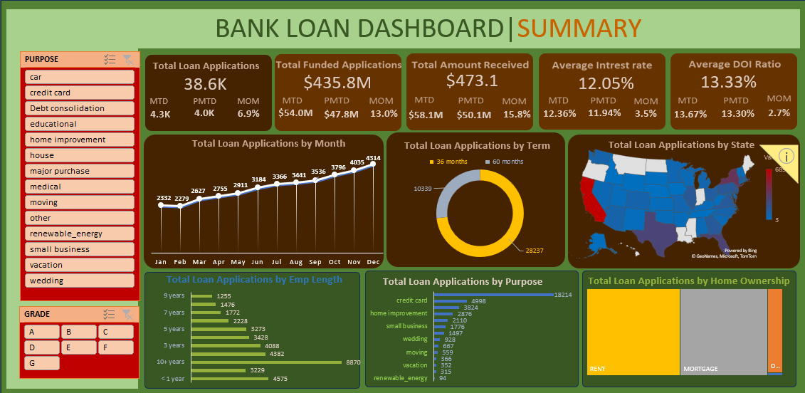
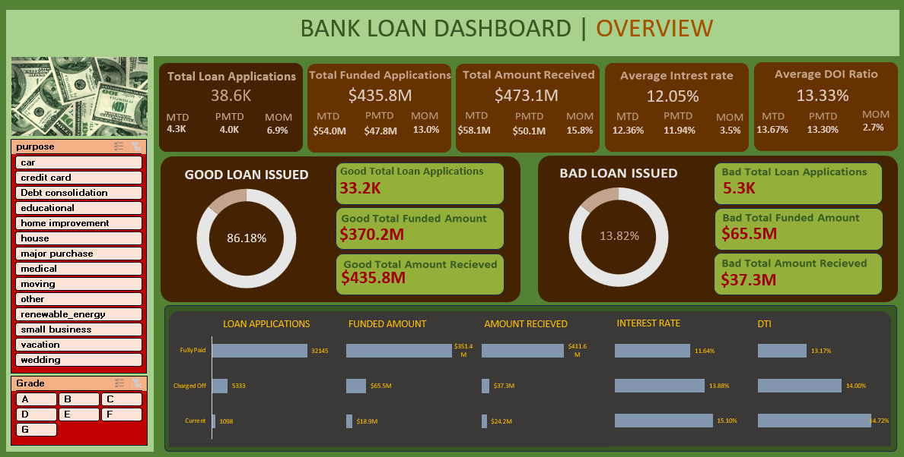

# Bank Loan Data Analysis and Visualization

## Overview

This repository hosts an Excel project focused on the analysis and visualization of Bank Loan data. The project utilizes Excel's capabilities to explore trends and patterns within the dataset, creating interactive charts and graphs. The objective is to enhance the understanding of the data and facilitate effective communication of insights. The culmination of these efforts is a comprehensive dashboard that provides a visual representation of key findings, empowering users to derive meaningful conclusions from the Bank Loan data.

## Insights

After a quick data exploration in the Excel dataset `financial.xlsx`, here are some initial findings:

- The Excel data comprises 12 tables covering various aspects of loan data.
- The data spans the year 2021.
- Home ownership has three classifications: Rent, Mortgage, and Own.
- The term is either 36 months or 60 months.
- Loan status has three classifications: Charged Off, Fully Paid, and Current.
- An additional column `good_vs_bad_loan` was added, classifying loans as good if Fully Paid or Current, and bad if Charged Off.
- There are 14 different loan purposes.

## Analysis

### Pivot Table Analysis

- Total Loan Application, Total Funded Amount, Total Amount Received, Average Interest rate, and Average DOI Ratio.
- Total Loan Application, Total Funded Amount, Total Amount Received, Average Interest rate, and Average DOI Ratio for Month to Day, Previous Month to Day, and Month to Month.
- Good vs Bad Loan Issued.
- Loan Status, Loan Amount, Loan payment, Average of interest rate, Average of DTI.

### Charts

- Total Loan Applications by Month.
- Total Loan Application by Term.
- Total Loan Application by State.
- Total Loan Application by Employment Length.
- Total Loan Application by Purpose.
- Total Loan Application by Home Ownership.
- Loan Applications, Funded Amount, Amount Received, Interest Rate, and DTI based on Loan Status.

## Dashboards

The dashboard's versatility extends to accommodating 14 distinct purposes and 7 different grades, ensuring a tailored and insightful analysis of the provided data.

### Summary Dashboard

This comprehensive dashboard presents key metrics encompassing Total Loan Applications, Funded Amount, Amount Received, Average Interest Rate, and various temporal analyses such as Month to Day, Previous Month to Day, and Month to Month. The interactive interface offers customizable visualizations, including charts depicting Total Loan Applications by Month, Loan Term, State, Employment Length, Purpose, and Home Ownership.

### Overview Dashboard

This comprehensive dashboard presents key metrics encompassing Total Loan Applications, Funded Amount, Amount Received, Average Interest Rate, and various temporal analyses such as Month to Day, Previous Month to Day, and Month to Month. It also includes charts depicting Good and Bad Loan Issued, Loan Applications, Funded Amount, and Amount Received.

## Key Metrics

- Total number of loan applications: 11.7K.
- Total funded amount: $130.7M.
- Total amount received: $140.8M.
- Average interest rate: 11.03%.
- Average Days of Issue (DOI) rate: 13.43%.
- Good loans issued: 86.18%.
- Bad loans issued: 13.82%.

## Conclusion

The Excel project on Bank Loan data offers a detailed analysis through pivot tables and charts, providing insights into key metrics such as loan applications, funded amounts, and interest rates. The interactive dashboards enable a nuanced exploration, catering to specific purposes and grades, enhancing data-driven decision-making.
